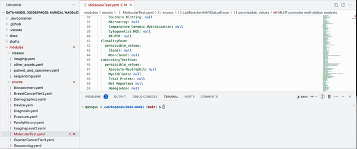

# Getting started

How to care for the data model and do important operations with schematic!

For quick and reproducible workflow, this guide is based on devcontainers, which:
- Should have the correct version of schematic installed with the schematic `config.yml` in the repository.
- Has all the creds you need.

In upper menu button, **Code > Create codespace on main**. 
You may need to wait a bit for the container to install tools and finish other setup.

## Update and make data model jsonld

1. Modify a `.yaml` file in the `modules` directory.
2. In the devcontainer at the root of the repo, type `make`. Animation of what it should look like:

## Generate templates

This is the command-line equivalent of using the schematic API or using the DCA UI to generate a template.

1. For generating templates, you need creds. (You only need to do this once with a new codespace. Locally, we can keep the `creds.json` In the command line and gitignore it so it is not committed to the repo.) Run this simple bash script at the codespace command line: `./scripts/setup_creds.sh`. You should see a `creds.json` file at the root of the repo, next to the `.jsonld` file, etc. Feel free to skim the bash script and the `.json` file.

2. Generate a blank Excel template for e.g. scRNAseq-Level1 by running `./scripts/gen_template.sh ImagingLevel2`. This generates an Excel template by default. Try replacing with another template ID. Try also copy-pasting contents of the script to the command-line to run schematic command natively, replacing variables as needed.

TODO - update script for these steps

3. Generate a blank Google template.

4. Generate a *filled-in* Google or Excel template for existing files on Synapse.

 
## Validate manifest

Note: this does not require creds setup.

TODO - add script for this step

